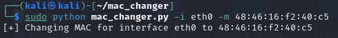

# Mac Changer

A MAC address is a unique identifier assigned to a network interface controller for use as a network address in communications within a network segment.

## Usage

When we type `ifconfig` on the terminal we see the following output -

        we see the mac address is 48:46:16:f2:40:c5

### After running the command

the mac address had been changed to the desired address.

